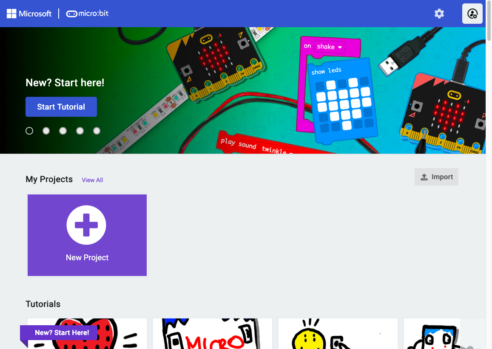
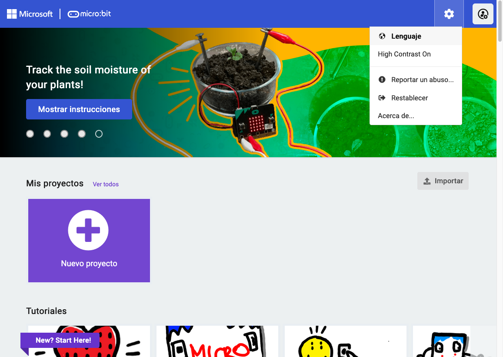
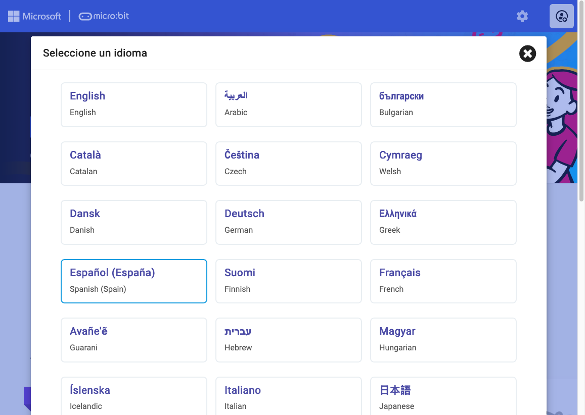
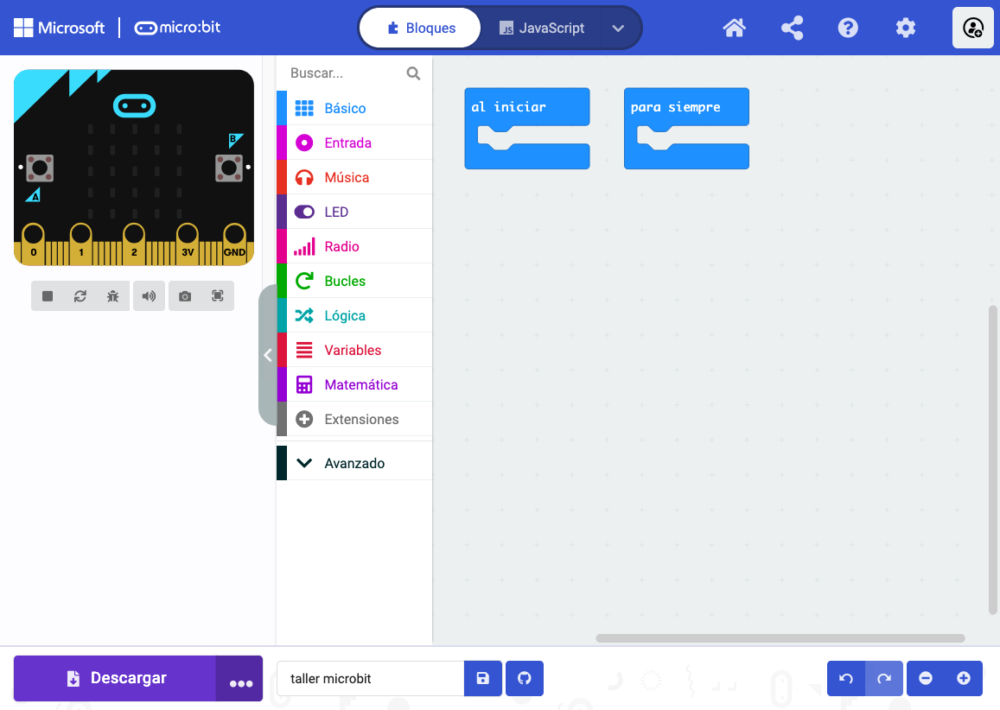
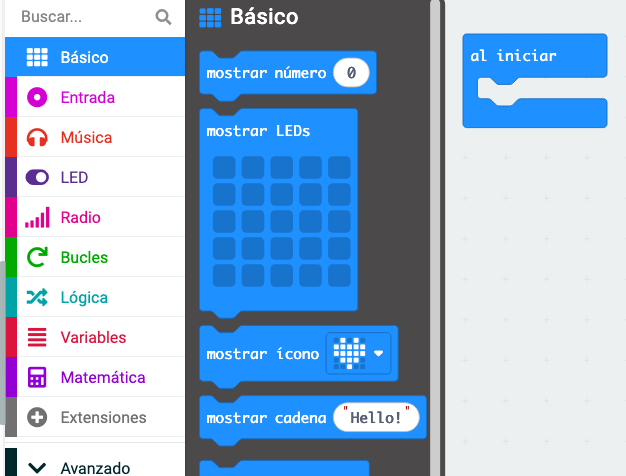
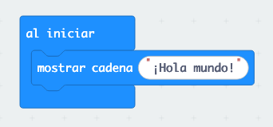

# Ejercicio 1: Introducción a MakeCode

## ¿Qué es MakeCode?

MakeCode es una página web súper chula donde puedes programar tu micro:bit sin necesidad de escribir código complicado. ¡Es como jugar con bloques de construcción, pero para crear programas!

## Paso 1: Abrir MakeCode

1. Abre tu navegador web (Chrome, Firefox, Safari, etc.)
2. Ve a la dirección: **makecode.microbit.org**
3. ¡Ya estás en MakeCode!

## Paso 2: Cambiar el idioma a español

¡Es mucho más fácil trabajar en nuestro idioma!

1. Busca el icono del engranaje ⚙️ en la parte superior derecha de la pantalla
2. Haz clic en él
3. Busca la opción "Language" o "Idioma"
4. Selecciona "Español"
5. La página se recargará en español

## Paso 3: Crear tu primer proyecto

1. Haz clic en el botón "Nuevo Proyecto"
2. Dale un nombre a tu proyecto, por ejemplo: "Mi primer programa"
3. Haz clic en "Crear"

## Paso 4: Conoce la interfaz

¡Ahora estás en el editor de MakeCode! Vamos a conocer las partes importantes:

### La caja de herramientas (izquierda)
Aquí están todos los bloques que puedes usar. Están organizados por categorías con diferentes colores:
- 🔵 **Básico**: Comandos básicos como mostrar texto o imágenes
- 🔴 **Entrada**: Para usar botones, sensores, etc.
- 🟢 **Música**: Para hacer sonidos y música
- 🟡 **LED**: Para controlar las luces
- Y muchos más...

### El área de trabajo (centro)
Aquí es donde arrastras y conectas los bloques para crear tu programa.

### El simulador (derecha)
¡Es un micro:bit virtual! Aquí puedes ver cómo funciona tu programa antes de enviarlo al micro:bit real.

## Tu Primer "Hola Mundo"

¡Vamos a crear tu primer programa!

### Paso 1: Encontrar el bloque correcto
1. En la caja de herramientas, haz clic en la categoría "Básico" (azul)
2. Busca el bloque que dice "mostrar cadena"
3. Arrástralo al área de trabajo
4. Conéctalo dentro del bloque "al iniciar" que ya está ahí

### Paso 2: Escribir tu mensaje
1. Haz clic en el texto que dice "Hello!" dentro del bloque
2. Bórralo y escribe "¡Hola mundo!"
3. ¡Mira el simulador! Ya puedes ver tu mensaje corriendo en la pantalla del micro:bit virtual

### Paso 3: Probar tu programa
¡Felicidades! Has creado tu primer programa. En el simulador puedes ver cómo las letras van apareciendo una por una en la pantalla del micro:bit.

## ¿Qué has aprendido?

- ✅ Cómo acceder a MakeCode
- ✅ Cómo cambiar el idioma a español
- ✅ Cómo crear un nuevo proyecto
- ✅ Las partes principales de la interfaz
- ✅ Cómo arrastrar y conectar bloques
- ✅ Tu primer programa: ¡Hola Mundo!

## ¿Preparado para el siguiente ejercicio?

¡Genial! Ahora que ya sabes lo básico, vamos a hacer algo más divertido en el [Ejercicio 2: Botones mágicos](02-botones-caras.md).

---

**💡 Consejo:** Si quieres experimentar, prueba a cambiar el texto por tu nombre o por otro mensaje. ¡La programación es más divertida cuando experimentas!
