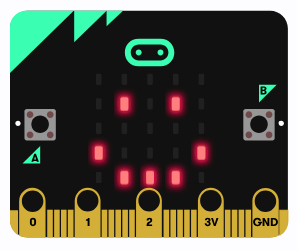

# Proyecto 2: 😊 Botones Mágicos - Caras Felices y Tristes

¡En este proyecto vas a aprender a usar los botones del micro:bit para mostrar diferentes caras! Es como darle emociones a tu micro:bit.

## ¿Qué vamos a hacer?

Vamos a programar el micro:bit para que:
- Cuando aprietes el botón A, muestre una cara feliz 😊
- Cuando aprietes el botón B, muestre una cara triste 😢
- Al principio, muestre una cara neutral

## Los botones del micro:bit

El micro:bit tiene dos botones principales:
- **Botón A**: Está a la izquierda
- **Botón B**: Está a la derecha

## Paso 1: Crear un nuevo proyecto

1. En MakeCode, haz clic en "Inicio" para volver al menú principal
2. Crea un nuevo proyecto y llámalo "Caras con botones"

## Paso 2: Mostrar una cara neutral al empezar

Primero, vamos a hacer que aparezca una cara neutral cuando el micro:bit se encienda.

1. Ve a la categoría "Básico" (azul)
2. Arrastra el bloque "mostrar LEDs" al bloque "al iniciar"
3. Haz clic en los cuadraditos para crear una cara neutral:

## Paso 3: Programar el botón A (cara feliz)

Ahora vamos a hacer que cuando aprietes el botón A aparezca una cara feliz.

1. Ve a la categoría "Entrada" (rosa)
2. Arrastra el bloque "al presionar el botón A" al área de trabajo
3. Ve a la categoría "Básico" y arrastra un "mostrar LEDs" dentro del bloque del botón A
4. Crea una cara feliz haciendo clic en los LEDs:

## Paso 4: Programar el botón B (cara triste)

¡Ahora el botón B para la cara triste!

1. De nuevo en "Entrada", arrastra "al presionar el botón A"
2. Cambia el boton A por el boton B
3. Añade un "mostrar LEDs" dentro
4. Crea una cara triste:

## Paso 5: ¡Prueba tu programa!

1. Mira el simulador del micro:bit
2. Haz clic en el botón A del simulador - ¡deberías ver la cara feliz!
3. Haz clic en el botón B del simulador - ¡deberías ver la cara triste!
4. Haz clic en el botón de reinicio (el círculo con una flecha) - ¡vuelve la cara neutral!

## ¡Experimenta más!

### Idea 1: Añadir más emociones
¿Qué pasa si presionas los dos botones a la vez? ¡Puedes añadir esa opción!

1. Ve a "Entrada" y busca "al presionar el boton A", y cambia A por A+B
2. Añádelo y crea una cara sorprendida o enfadada

### Idea 2: Añadir sonidos
¡Haz que cada cara tenga su propio sonido!

1. Ve a la categoría "Música" (verde)
2. Arrastra bloques de "reproducir tono" después de cada "mostrar LEDs"
3. Elige tonos diferentes para cada emoción

## ¿Qué has aprendido?

- ✅ Cómo usar los botones A y B del micro:bit
- ✅ Cómo crear dibujos con los LEDs usando "mostrar LEDs"
- ✅ Cómo hacer que el micro:bit responda a diferentes acciones
- ✅ Que puedes hacer programas interactivos

## Problemas comunes

**🤔 ¿No funciona un botón?**
- Asegúrate de que has selecciónado el boton correcto (por ejemplo, A en lugar de B).
- Comprueba que el bloque "mostrar LEDs" está dentro del bloque del botón.

**🤔 ¿La cara no se ve bien?**
- Revisa que has hecho clic en los LEDs correctos.

## ¿Preparado para más aventuras?

¡Fantástico! En el siguiente proyecto vamos a hacer que el micro:bit detecte cuando lo mueves. ¡Ve al [Proyecto 3: ¡En movimiento!](03-acelerometro.md)!

---

**💡 Consejo:** ¡Puedes crear las caras que quieras! Prueba a hacer una cara con gafas, con la lengua fuera, o incluso dibujos que no sean caras. ¡Deja volar tu imaginación!
