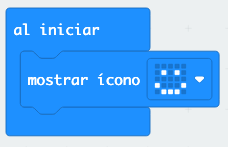
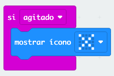
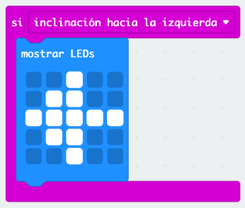
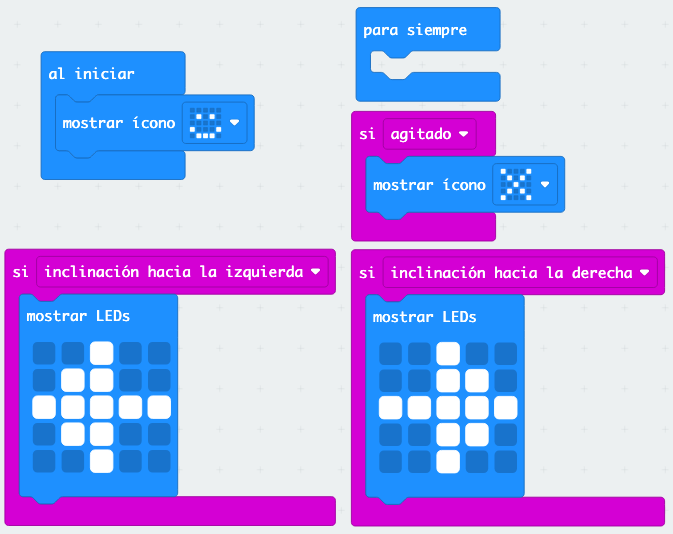
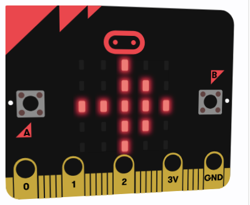
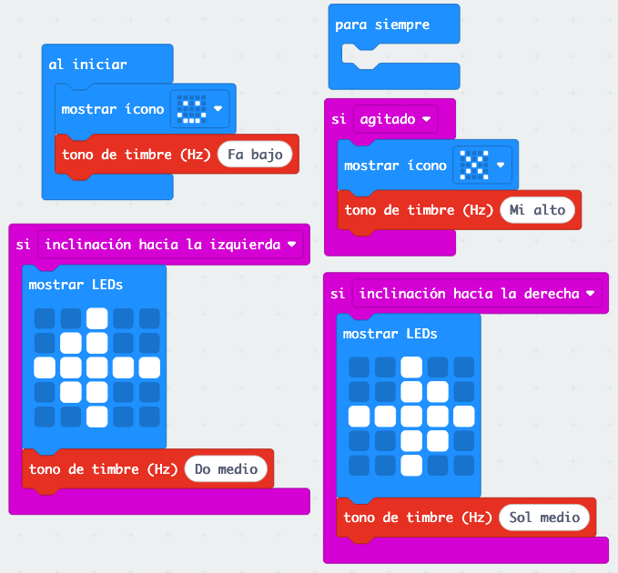
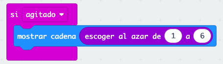

# Proyecto 3: 🏃 ¡En Movimiento! - Usando el Acelerómetro

¡El micro:bit tiene un sensor súper chulo que puede detectar cuando lo mueves! Se llama acelerómetro, y en este proyecto vas a aprender a usarlo.

## ¿Qué es un acelerómetro?

Un acelerómetro es como un sensor mágico que puede detectar:
- Si agitas el micro:bit
- Si lo inclinas hacia la izquierda o derecha
- Si lo pones boca abajo
- Si lo mueves bruscamente

¡Es el mismo sensor que tienen los móviles para girar la pantalla!

## ¿Qué vamos a hacer?

Vamos a crear un programa que:
1. **Al agitar** el micro:bit: muestre una X 
2. **Al inclinar hacia la izquierda**: muestre una flecha hacia la izquierda
3. **Al inclinar hacia la derecha**: muestre una flecha hacia la derecha
4. **Normalmente**: muestre una cara normal

## Paso 1: Crear el proyecto

1. Crea un nuevo proyecto llamado "Detector de movimiento"
2. Primero vamos a poner una cara normal al empezar
3. Esta vez usaremos "mostrar ícono" en lugar de "mostrar LEDs"

En el bloque "al iniciar", añade un "mostrar ícono" con esta cara:

## Paso 2: Detectar cuando agitas el micro:bit

¡Vamos a hacer algo divertido cuando agites el micro:bit!

1. Ve a la categoría "Entrada" (rosa)
2. Busca el bloque "si agitado"
3. Arrástralo al área de trabajo
4. Dentro, pon un "mostrar ícono" con una X:

## Paso 3: Detectar inclinación hacia la izquierda

Ahora vamos a hacer que aparezca una flecha cuando inclines el micro:bit.

1. En "Entrada", busca "si agitado"
2. Arrástralo al área de trabajo
3. Cambiar "agitado" por "inclinación hacia la izquierda"
3. Añade un "mostrar LEDs" con una flecha hacia la izquierda:

## Paso 4: Detectar inclinación hacia la derecha

¡Lo mismo para la derecha!

1. Añade "si inclinación hacia la derecha"
2. Pon una flecha hacia la derecha:

## Paso 5: ¡Prueba tu programa!

1. En el simulador, puedes simular los movimientos:
   - Haz clic en "SHAKE" para simular agitar
   - Mueve el raton donde está el simulador micro:bit para simular inclinación

## ¡Vamos a mejorarlo!

### Añadir más movimientos

Puedes añadir más tipos de movimientos:
- "si pantalla hacia arriba"
- "si pantalla hacia abajo"
- "si caída libre"

### Añadir sonidos

¡Haz que cada movimiento tenga su sonido!

1. Ve a "Música" y añade "tono de timbre (Hz) Do medio" después de cada "mostrar LEDs"
2. Usa tonos diferentes para cada movimiento:
   - Agitar: tono alto y rápido
   - Izquierda/derecha: tonos medios
   - Normal: tono suave

## Experimento divertido: Dados digitales

¡Vamos a crear unos dados que funcionen agitando el micro:bit!

1. Cambia el bloque "al agitar"
2. En lugar de mostrar una cara mareada, usa "mostrar número"
3. Ve a "Matemáticas" y busca "número al azar entre 1 y 6"
4. ¡Ahora cada vez que agites aparecerá un número del 1 al 6!

## ¿Qué has aprendido?

- ✅ Qué es un acelerómetro y para qué sirve
- ✅ Cómo detectar diferentes tipos de movimiento
- ✅ Los bloques: "al agitar", "al inclinar"
- ✅ Cómo hacer un programa que responde al movimiento físico
- ✅ Cómo crear dados digitales

## Problemas comunes

**🤔 ¿No funciona al agitar?**
- En el simulador, asegúrate de hacer clic en "SHAKE"
- Si usas un micro:bit real, agítalo con más fuerza (¡pero con cuidado!)

**🤔 ¿Las inclinaciones no funcionan bien?**
- Inclina el micro:bit más claramente hacia un lado
- En el simulador, asegurate que el micro:bit simulado se inclina para el lado que es.

## Retos extra

1. **Contador de pasos**: Haz que cada vez que agites, aumente un número (como un podómetro)
2. **Alarma de movimiento**: Que suene una alarma cuando detecte movimiento
3. **Juego de equilibrio**: Que muestre "¡Bien!" solo cuando esté completamente plano

## ¿Preparado para tu siguiente proyecto?

¡Increíble! Has dominado los sensores del micro:bit. Ahora vamos a combinar todo lo que sabes para crear una linterna súper inteligente. Ve al [Proyecto 4: Linterna Inteligente](04-linterna-inteligente.md).

---

**💡 Consejo:** El acelerómetro es muy sensible. Si tu programa reacciona demasiado, intenta movimientos más suaves. ¡Y si no reacciona suficiente, muévelo con más decisión!
