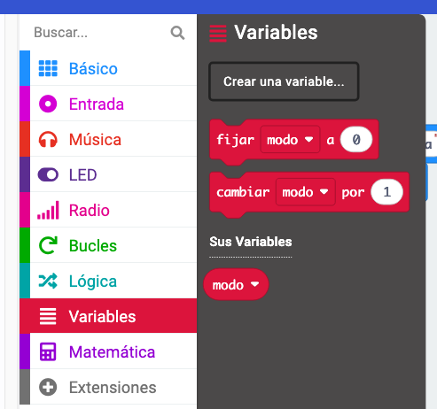
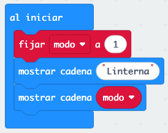
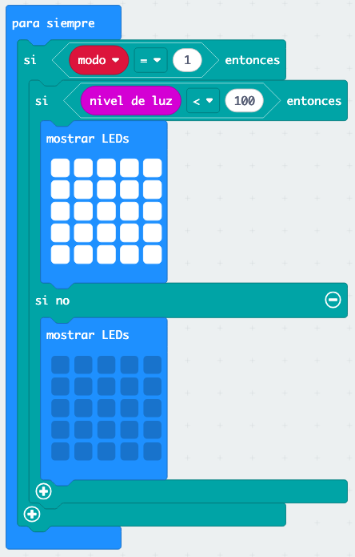
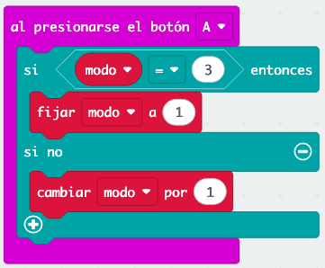
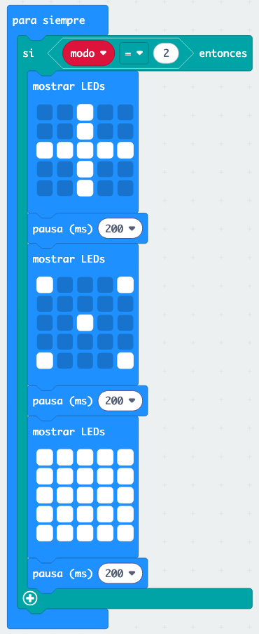
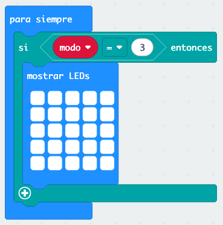

# Ejercicio 4: 🔦 Linterna Inteligente

¡Vamos a convertir tu micro:bit en una linterna súper inteligente que se enciende automáticamente cuando está oscuro y tiene modos especiales!

## ¿Qué vamos a hacer?

Nuestra linterna inteligente tendrá:
- 🌙 **Modo automático**: Se enciende cuando detecta oscuridad
- 🕺 **Modo discoteca**: Luces que parpadean al ritmo
- 🔦 **Modo linterna normal**: Siempre encendida

## ¿Qué es el sensor de luz?

El micro:bit puede "ver" si hay luz o está oscuro usando su **sensor de luz**. ¡Es como si fuera un ojo electrónico! El sensor nos da un número:
- **0 = Muy oscuro** (como de noche)
- **255 = Muy brillante** (como al sol)

## Paso 1: Crear el proyecto

1. Crea un nuevo proyecto llamado "Linterna Inteligente"
2. Vamos a empezar con una variable para saber qué modo estamos usando

### Crear variables:
1. Ve a "Variables" (naranja)
2. Crea una variable llamada "modo"



## Paso 2: Configuración inicial

En el bloque "al iniciar":

1. **Establecer modo a 1** (empezamos en modo automático)
2. **Mostrar texto "LINTERNA"**
3. **Pausa de 1 segundo**
4. **Mostrar número** de la variable "modo"



## Paso 3: Programar el modo automático

¡Aquí viene la magia! Vamos a hacer que la linterna detecte cuando está oscuro.

1. Arrastra un bloque "para siempre" al área de trabajo
2. Dentro del "para siempre", programa la lógica automática:

### Decidir si encender la linterna:
1. Ve a "Lógica" y arrastra un bloque "si... entonces... si no"
2. Ve a "Entrada" y busca el bloque "nivel de luz"
3. Programa esta lógica:

```
si modo = 1 entonces
    si nivel de luz < 100 entonces
        mostrar LEDs (todos encendidos)
    si no
        borrar pantalla
```

**💡 El bloque "nivel de luz" está en la categoría "Entrada" y te da directamente el valor del sensor.**

**Patrón de LEDs todos encendidos:**
```
# # # # #
# # # # #
# # # # #
# # # # #
# # # # #
```



## Paso 4: Cambiar de modo con el botón A

Vamos a poder cambiar entre diferentes modos:

1. Arrastra "al presionar botón A"
2. Programa el cambio de modo:

```
si modo = 3 entonces
    establecer modo a 1
si no
    cambiar modo por 1
mostrar número modo
```

Los modos serán:
- **1** = Automático
- **2** = Discoteca
- **3** = Linterna normal



## Paso 5: Modo discoteca

¡Ahora el modo más divertido! Luces que cambian de patrón rápidamente:

```
si no si modo = 2 entonces
    mostrar LEDs (patrón 1)
    pausa 200 ms
    mostrar LEDs (patrón 2)
    pausa 200 ms
    mostrar LEDs (patrón 3)
    pausa 200 ms
```

**Patrón 1 (cruz):**
```
. . # . .
. . # . .
# # # # #
. . # . .
. . # . .
```

**Patrón 2 (esquinas):**
```
# . . . #
. . . . .
. . # . .
. . . . .
# . . . #
```

**Patrón 3 (todo encendido):**
```
# # # # #
# # # # #
# # # # #
# # # # #
# # # # #
```



## Paso 6: Modo linterna normal

El más sencillo, siempre encendida:

```
si no
    mostrar LEDs (todos encendidos)
```



## Paso 7: ¡Prueba tu linterna!

1. **Prueba el modo automático**: Tapa el micro:bit con la mano para simular oscuridad
2. **Presiona botón A**: Para cambiar entre modos
3. **Modo discoteca**: ¡Debería parecer una fiesta de luces!

## Mejoras extra

### Botón B para modo discoteca
Añade un "al presionar botón B" que vaya directamente al modo discoteca:

```
establecer modo a 2
mostrar ícono de música
```

### Ajustar sensibilidad de luz
Si la linterna se enciende demasiado o muy poco, cambia el número 100 por:
- **50** para que sea más sensible (se enciende con poca oscuridad)
- **150** para que sea menos sensible (solo se enciende cuando esté muy oscuro)

### Añadir sonidos
¡Haz que cada modo tenga su propio sonido!

1. Ve a la categoría "Música" (verde)
2. Añade bloques de "reproducir tono" en cada modo:
   - **Modo automático**: Tono suave cuando se enciende (262 Hz)
   - **Modo discoteca**: Diferentes tonos con cada patrón
     - Patrón 1: `reproducir tono 262 Hz durante 200 ms`
     - Patrón 2: `reproducir tono 523 Hz durante 200 ms`  
     - Patrón 3: `reproducir tono 1047 Hz durante 200 ms`

### Modo arcoíris
¡Añade un cuarto modo que cycle entre diferentes patrones de formas!

## ¿Qué has aprendido?

- ✅ Cómo usar el sensor de luz del micro:bit
- ✅ Programación con múltiples modos
- ✅ Usar bucles "repetir" para patrones
- ✅ Combinar sensores con lógica condicional
- ✅ Crear efectos visuales con temporizaciones

## Problemas comunes

**🤔 ¿La linterna no se enciende automáticamente?**
- Prueba tapando completamente el micro:bit con las manos
- Ajusta el valor 100 a un número más alto (como 150)

**🤔 ¿El modo discoteca va muy rápido o muy lento?**
- Cambia los valores de pausa: más números = más lento
- Prueba con diferentes velocidades: 100ms, 300ms, 500ms

**🤔 ¿No cambia de modo?**
- Revisa que la variable "modo" se actualiza correctamente
- Asegúrate de que los números en las condiciones son correctos (1, 2, 3, 4)

## Usos reales

¡Tu linterna inteligente puede ser súper útil!

- 🏕️ **Acampada**: Linterna automática que se enciende cuando oscurece
- 🎉 **Fiestas**: Modo discoteca para animar el ambiente
- 🔍 **Exploración**: Linterna normal para buscar cosas

## ¿Preparado para más diversión?

¡Genial! Ahora que dominas los sensores y los modos, vamos a hacer música con tu micro:bit en el [Ejercicio 5: Piano Mágico](05-piano-magico.md).

---

**💡 Consejo:** El sensor de luz del micro:bit es muy útil. Puedes usarlo para crear muchos proyectos automáticos como luces nocturnas, despertadores con luz natural, o sistemas de seguridad simples.
