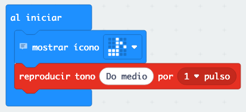
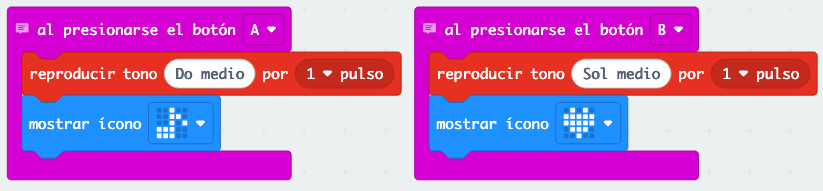
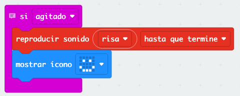
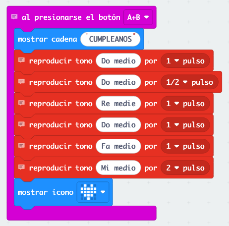

# Ejercicio 5: 🎵 Piano Mágico

¡Vamos a convertir tu micro:bit en un piano que puedes tocar con los botones! Podrás crear melodías, tocar canciones conocidas y hasta componer tu propia música.

## ¿Qué vamos a hacer?

Nuestro piano mágico tendrá:
- 🎹 **Botones como teclas**: A y B para tocar notas diferentes
- 🎵 **Una canción sencilla**: "Cumpleaños Feliz"
- 🎶 **Efectos divertidos**: Sonidos cuando inclinas el micro:bit

## ¿Cómo funciona el sonido en micro:bit?

El micro:bit puede hacer música! Cada nota tiene un sonido diferente:
- **Do** = sonido grave (bajo)
- **Sol** = sonido agudo (alto)

¡Es como un piano: algunas teclas suenan grave y otras agudo!

## Paso 1: Crear el proyecto

1. Crea un nuevo proyecto llamado "Piano Mágico"
2. ¡Esta vez no necesitamos variables! Vamos directo a la música.

## Paso 2: Configuración inicial

En el bloque "al iniciar":

1. **Mostrar ícono de música**
2. **Reproducir tono Do durante 1 segundo** (saludo musical)

## Paso 3: Programar las teclas básicas

¡Vamos a hacer que los botones toquen notas!

1. Ve a "Entrada" (rosa) y arrastra "al presionar botón A"
2. Ve a "Música" (rojo) y arrastra "reproducir tono Do durante 1 tiempo"
3. Ve a "Básico" y arrastra "mostrar ícono" con una nota musical

### Para el Botón B:
1. Igual que el botón A, pero cambia "Do" por "Sol"
2. Usa un ícono diferente (como un corazón)

## Paso 4: Añadir efectos divertidos

¡Vamos a hacer que el micro:bit haga sonidos cuando lo mueves!

1. Ve a "Entrada" y arrastra "al agitar"
2. Añade "reproducir sonido giggle" (o el sonido que más te guste)
3. Añade "mostrar ícono" con una cara feliz

## Paso 5: Tocar una canción simple

¡Vamos a programar "Cumpleaños Feliz"!

1. Ve a "Entrada" y arrastra "al presionar A+B"
2. Añade "mostrar texto" con "CUMPLEANOS"
3. Ahora añade estos tonos uno después del otro:
   - Reproducir tono Do durante 1 tiempo
   - Reproducir tono Do durante 1/2 tiempo  
   - Reproducir tono Re durante 1 tiempo
   - Reproducir tono Do durante 1 tiempo
   - Reproducir tono Fa durante 1 tiempo
   - Reproducir tono Mi durante 2 tiempos
4. Añade "mostrar ícono" con un corazón al final

## Paso 6: ¡Prueba tu piano!

1. **Presiona botón A**: ¿Suena Do?
2. **Presiona botón B**: ¿Suena Sol?
3. **Agita el micro:bit**: ¿Hace un sonido divertido?
4. **Presiona A+B**: ¿Toca "Cumpleaños Feliz"?

## ¿Qué has aprendido?

- ✅ Cómo hacer música con el micro:bit
- ✅ Usar botones para tocar notas
- ✅ Programar una canción completa
- ✅ Añadir efectos de sonido divertidos

## Mejoras extra

### Añadir más sonidos
¡Experimenta con diferentes sonidos!

1. Ve a "Música" y busca "reproducir sonido"
2. Prueba sonidos como "twinkle", "spring", "mysterious"
3. Añádelos cuando presiones diferentes botones

### Más notas musicales
¿Quieres más notas?

1. Usa los gestos de inclinar para tocar "Mi" y "Fa"
2. Añade "al inclinar hacia la izquierda" con tono Mi
3. Añade "al inclinar hacia la derecha" con tono Fa

## Problemas comunes

**🤔 ¿No se oye nada?**
- Sube el volumen del simulador
- Comprueba que has puesto los bloques dentro de los eventos

**🤔 ¿La canción suena rara?**
- Asegúrate de que las notas están en el orden correcto
- Verifica que cada nota tiene su duración

## ¿Preparado para el gran final?

¡Increíble! Has creado tu propio instrumento musical. Ahora vamos al proyecto final más complejo: ¡tu propio juego completo! Ve al [Ejercicio 6: Piedra, Papel o Tijera](06-piedra-papel-tijera.md).

---

**💡 Consejo musical:** Las mejores melodías combinan notas altas y bajas. ¡Experimenta con diferentes combinaciones y encuentra tu estilo único!
