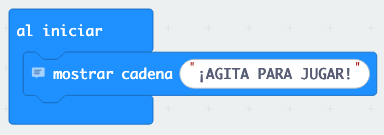
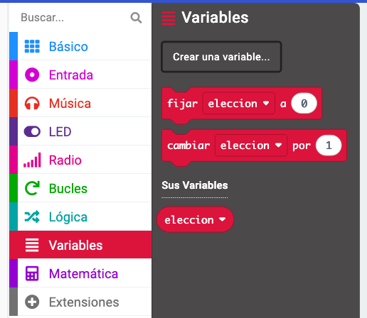
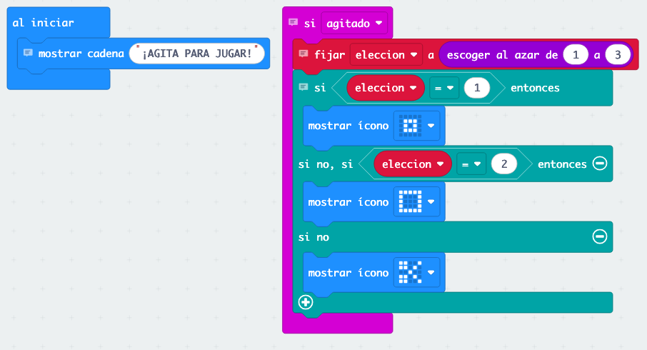
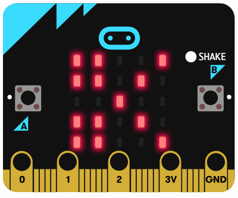

# Ejercicio 6: ¡A Jugar! - Piedra, Papel o Tijera

¡Vamos a crear el juego más famoso del mundo en tu micro:bit! Podrás jugar con tus amigos en cualquier lugar.

## ¿Cómo funciona el juego?

El micro:bit elegirá al azar entre:
- 🗿 **Piedra**: gana a tijera, pierde contra papel
- 📄 **Papel**: gana a piedra, pierde contra tijera  
- ✂️ **Tijera**: gana a papel, pierde contra piedra

## ¿Cómo jugar?

1. Tú y tu amigo agitáis vuestros micro:bits al mismo tiempo
2. Aparece el resultado en cada micro:bit
3. ¡Comparáis para ver quién gana!

## Paso 1: Crear el proyecto

1. Crea un nuevo proyecto llamado "Piedra Papel Tijera"
2. Al empezar, vamos a mostrar un mensaje de bienvenida

En "al iniciar", añade:
- Un bloque "mostrar texto" con "¡AGITA PARA JUGAR!"



[PLACEHOLDER: Captura del bloque "al iniciar" con el mensaje de bienvenida]

## Paso 2: Crear los dibujos

Primero vamos a diseñar cómo se ve cada opción en los LEDs:

### Piedra (un círculo sólido):
```
. # # # .
# # # # #
# # # # #
# # # # #
. # # # .
```

### Papel (un cuadrado):
```
# # # # #
# . . . #
# . . . #
# . . . #
# # # # #
```

### Tijera (dos líneas cruzadas):
```
# . . . #
. # . # .
. . # . .
. # . # .
# . . . #
```

## Paso 3: Programar el juego

¡Ahora viene la parte divertida! Vamos a hacer que al agitar aparezca una opción al azar.

1. Arrastra un bloque "al agitar" al área de trabajo
2. Vamos a necesitar una **variable** para guardar la elección

### Crear una variable:
1. Ve a la categoría "Variables" (naranja)
2. Haz clic en "Crear una variable"
3. Llámala "elección"



[PLACEHOLDER: Captura de cómo crear una variable]

### Programar la lógica:
Dentro del bloque "al agitar":

1. **Asignar un número al azar**:
   - Arrastra "establecer elección a" 
   - Ve a "Matemáticas" y busca "número al azar entre 1 y 3"

2. **Decidir qué mostrar**:
   - Ve a "Lógica" y arrastra un bloque "si... entonces... si no"
   - Haz clic en el engranaje ⚙️ para añadir más condiciones (necesitas 3 en total)

La estructura será:
```
si elección = 1 entonces
    mostrar LEDs (piedra)
si no si elección = 2 entonces  
    mostrar LEDs (papel)
si no
    mostrar LEDs (tijera)
```



[PLACEHOLDER: Captura del programa completo con el bloque "al agitar" y toda la lógica]

## Paso 4: ¡Prueba tu juego!

1. En el simulador, haz clic en "SHAKE"
2. ¿Aparece una de las tres opciones?
3. Prueba varias veces para ver que cambia



[PLACEHOLDER: Captura del simulador mostrando diferentes resultados]

## Mejoras divertidas

### Añadir sonido
Haz que cada opción tenga su sonido característico:

1. Ve a "Música"
2. Añade diferentes tonos después de cada "mostrar LEDs":
   - Piedra: tono grave (262 Hz)
   - Papel: tono medio (523 Hz)
   - Tijera: tono agudo (1047 Hz)

### Añadir cuenta atrás
¡Haz que el juego sea más emocionante con una cuenta atrás!

Cambia el bloque "al agitar" para que primero haga:
1. Mostrar "3"
2. Pausa de 1 segundo
3. Mostrar "2"  
4. Pausa de 1 segundo
5. Mostrar "1"
6. Pausa de 1 segundo
7. ¡Mostrar el resultado!


[PLACEHOLDER: Captura del programa mejorado con cuenta atrás]

## Versión avanzada: Multijugador

¿Quieres hacer el juego aún más genial? ¡Vamos a añadir un sistema de puntuación!

### Añadir botones para comparar
- **Botón A**: "¡He ganado!"
- **Botón B**: "¡He perdido!"

### Crear variables de puntuación
1. Crea una variable llamada "mis_puntos"
2. Crea otra llamada "puntos_rival"

### Programar los botones
En "al presionar botón A":
- Aumentar "mis_puntos" en 1
- Mostrar "mis_puntos"

En "al presionar botón B":
- Aumentar "puntos_rival" en 1  
- Mostrar "puntos_rival"

## ¿Qué has aprendido?

- ✅ Cómo usar números aleatorios
- ✅ Qué son las variables y cómo usarlas
- ✅ Cómo usar bloques condicionales (si... entonces...)
- ✅ Cómo crear un juego completo
- ✅ Cómo añadir sonidos y efectos

## Problemas comunes

**🤔 ¿Siempre sale lo mismo?**
- Revisa que usas "número al azar entre 1 y 3"
- Asegúrate de que la variable se actualiza cada vez que agitas

**🤔 ¿No aparece nada al agitar?**
- Comprueba que el bloque "establecer elección" está dentro de "al agitar"
- Verifica que las condiciones son "elección = 1", "elección = 2", etc.

**🤔 ¿Los dibujos no se ven bien?**
- Revisa que has clickeado los LEDs correctos en cada "mostrar LEDs"

## Retos extra

1. **Añadir "Lagarto" y "Spock"** (como en "The Big Bang Theory")
2. **Crear un torneo**: El primero en llegar a 5 puntos gana
3. **Modo difícil**: Que el resultado aparezca más rápido
4. **Estadísticas**: Contar cuántas veces sale cada opción

## ¡Felicidades!

¡Has completado todos los ejercicios del taller! Ahora tienes un micro:bit que puede:
- Mostrar mensajes
- Responder a botones
- Detectar movimiento
- ¡Y hasta jugar contigo!

### ¿Qué puedes hacer ahora?

- Enseña tus programas a tus amigos y familia
- Experimenta combinando las ideas de todos los ejercicios
- Investiga qué otros sensores tiene el micro:bit
- ¡Inventa tus propios juegos y programas!

### Próximos pasos

Si te ha gustado programar, puedes:
- Aprender otros lenguajes de programación
- Explorar Arduino o Raspberry Pi
- Unirte a clubes de robótica
- ¡Seguir creando cosas increíbles!

---

**💡 Recuerda:** La programación es como aprender un idioma nuevo. Cuanto más practiques, ¡mejor serás! No tengas miedo de experimentar y probar cosas nuevas.
